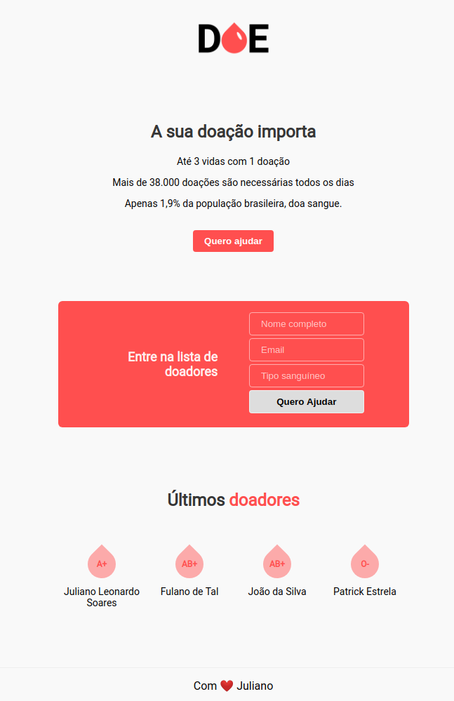

<h1 align="center">
    
</h1>

<h2 align="center">
   
💉 Doe sangue! Doe vida! &#128159

</h2>

  

  
  
  

  

  

  <a href="#rocket-tecnologias">Tecnologias</a>&nbsp;&nbsp;&nbsp;|&nbsp;&nbsp;&nbsp;
  <a href="#computer-projeto">Projeto</a>&nbsp;&nbsp;&nbsp;|&nbsp;&nbsp;&nbsp;
  <a href="#question-como-contribuir">Como contribuir</a>&nbsp;&nbsp;&nbsp;

 
<h3>Protótipo:<h3>

  

## :rocket: Tecnologias
- [HTML](https://www.w3schools.com/js/js_htmldom_document.asp)
- [CSS](https://devdocs.io/css/)
- [JAVASCRIPT](https://devdocs.io/javascript/)

## :computer: Projeto
> Projeto feito durante a semana MaratonaDev da Rocketseat, com o intuito de práticar mais com algo simples.

## :question: Como contribuir

###### Criando Issue:
- Faça um issue nesse repositório;
- Crie novas features ou informe um bug e se possivel um link com a captura do erro;
- Aguarde até ser respondido no issue;

> Depois que o issue for concluido, ele será enviado para produção e aparecerá no github corrigido.
###### Fazendo o fork do projeto:
- Faça o fork do repositório e modifique como achar necessário;
- E se possivel me mencione na sua versão;
- E me mande uma mensagem para eu dar uma olhada;
###### Clone o projeto:
- Faça o clone no projeto e modifique como achar necessário;
- E se possivel me mencione na sua versão;
- E me mande uma mensagem para eu dar uma olhada;
